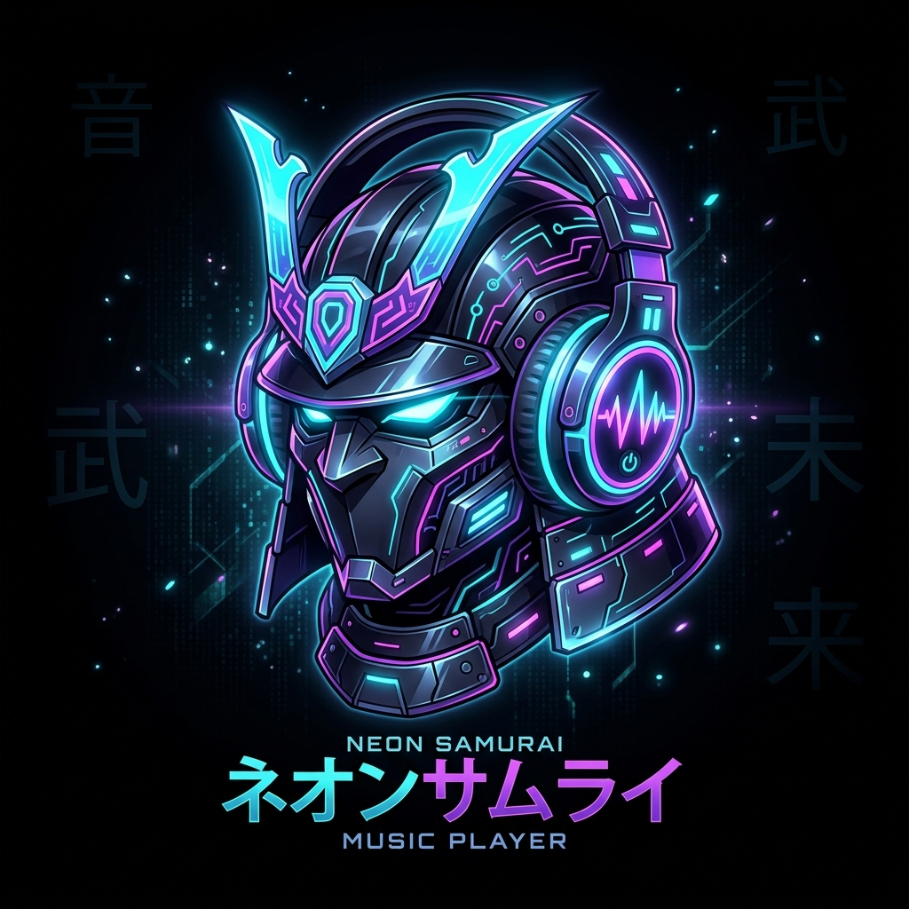
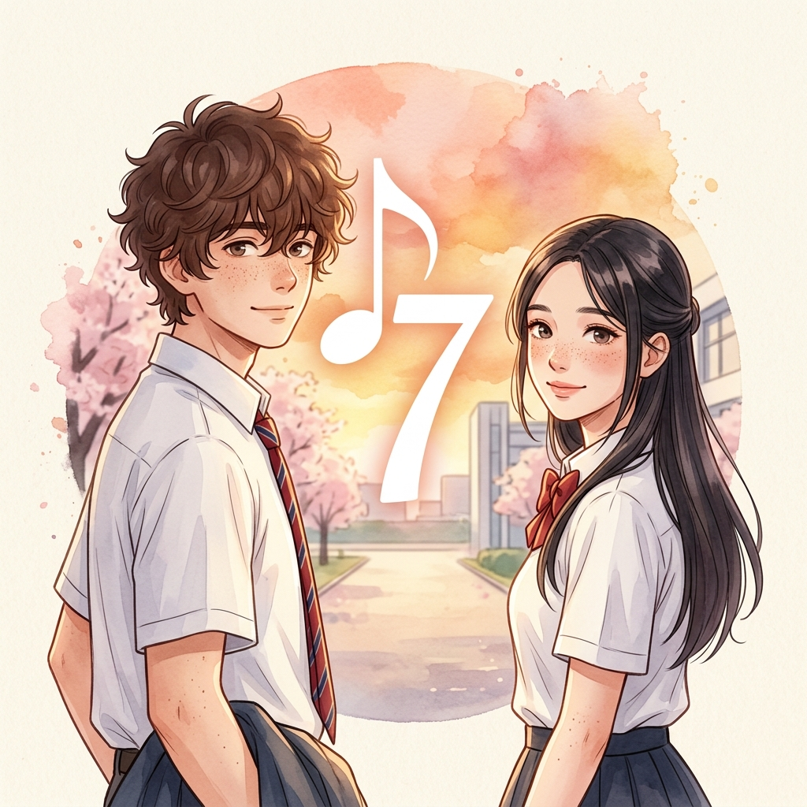
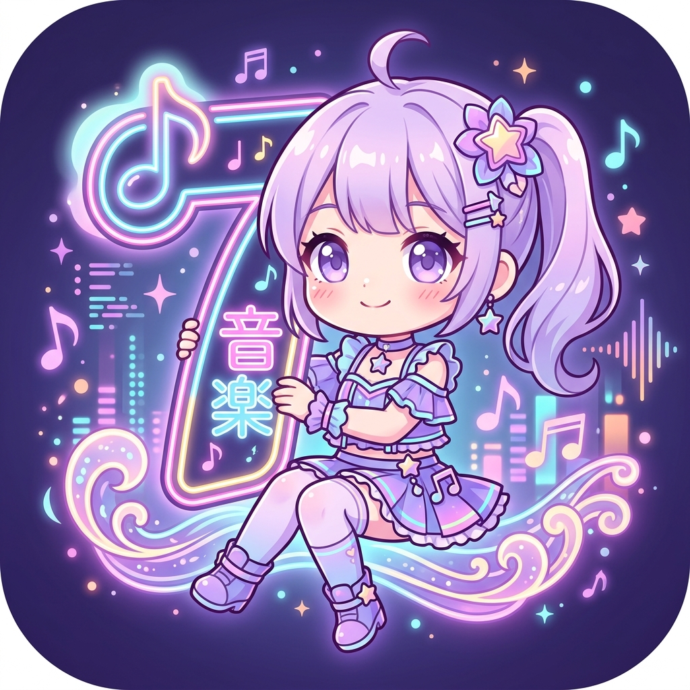
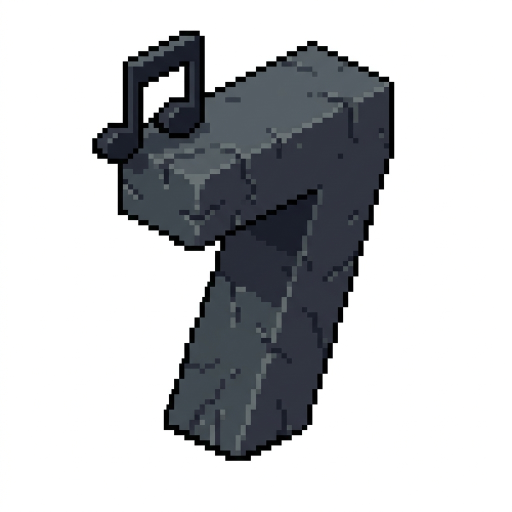
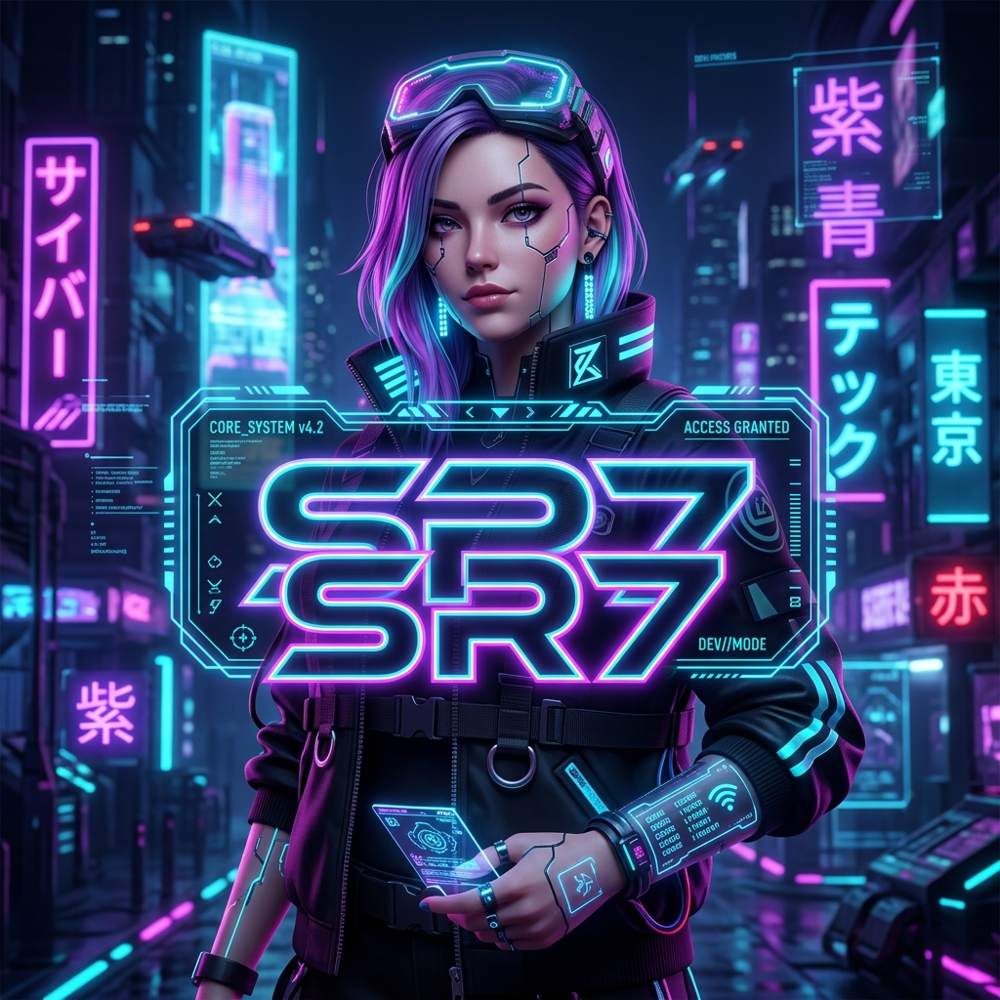

<div align="center">


# 🎵 Ongaku7 (音楽7)

**Advanced High-Performance Audio Manager & Glassmorphic Sound Engine for Android**

<!-- GitHub Shields / Badges Card -->
<p>
  <a href="https://kotlinlang.org/"></a>
  <a href="https://developer.android.com/jetpack/compose"></a>
  <a href="https://developer.android.com/"></a>
  <a href="https://developer.android.com/media/media3"></a>
  <a href="https://m3.material.io/"></a>
  <a href="https://developer.android.com/training/data-storage/room"></a>
  <a href="LICENSE"></a>
  <a href="https://github.com/alexsifatrayhan"></a>
</p>

</div>

---

## 🌟 Key Features

* **🎧 High-Fidelity Audio Engine & Media3 Architecture**:
  * **AndroidX Media3 ExoPlayer Core**: Ultra-low latency decoding supporting MP3, FLAC, WAV, AAC, OGG, and M4A with background foreground service playback (`MediaPlaybackService`) and rich lockscreen media controls.
  * **🌀 Real-Time 8D Binaural Audio Processor**: Custom real-time LFO spatial panner simulating 360° orbital sound around your head, with granular LFO frequency speed (`0.01 Hz` to `1.0 Hz`) and stereo depth modulation (`0%` to `100%`).
  * **🎚️ 5-Band Equalizer & Bass Boost**: Hardware-accelerated graphic equalizer (60Hz, 230Hz, 910Hz, 4kHz, 14kHz) plus dynamic bass booster.
  * **🏛️ Dual Reverb System**: Toggle between authentic acoustic simulation (**Room Reverb**: Small Room, Medium Room, Large Room, Medium Hall, Large Hall, Plate) and **Hz Band Reverb** modes.
  * **⏩ Pitch & Tempo Shifting**: Independent audio pitch and speed warping (`0.25x` to `2.0x`) in real time without audio glitching.
  * **🔁 A/B Precision Looping**: Set custom Start (A) and End (B) loop markers with millisecond precision for vocal learning, instrument practicing, or infinite beat loops.
  * **🔀 4-State Playback Modes**: Cycle between **Normal** (Stop at end), **Loop All** (Continuous playlist), **Loop One** (Single track repeat), and **Shuffle** (Randomized non-repeating queue).

* **📜 Synchronized LRC Lyrics Hub**:
  * **Automated Lyrics Engine**: Automatically reads embedded ID3 tags (USLT, SYLT) or synchronizes with companion `.lrc` files found in your local audio directories.
  * **Dynamic Visual Karaoker**: Smooth scrolling, active stanza neon glow, and click-to-seek timestamp navigation.

* **🎨 Cyberpunk & Glassmorphic Visuals**:
  * **Frosted Glass Cards (`GlassBox`)**: Multi-layered backdrop blurs, iridescent neon borders, and dynamic ambient background glow.
  * **AndroidX Palette Color Extraction**: Dynamically samples dominant, vibrant, and muted tones from the currently playing album artwork to tint background glow halos in real-time.
  * **4 Distinct Album Artwork Modes**: Choose from **Rounded Corner**, **Rotating Vinyl Disc**, **3D Floating Card**, or **Ambient Glow Halo**.
  * **Custom UI Icon Themes**: Switch between **Cyberpunk Neon**, **Filled**, **Outlined**, and **Rounded** icon packs.

* **🎭 Dynamic App Launcher Icon Switcher**:
  * Switch your device's home screen launcher icon directly from inside Settings using Android Activity Aliases:
    * ⚡ **Default Studio Icon** — *Crafted by SR7 Mods*
    * 🌸 **Spring Days** — *Designed in collaboration with SR7 Crasher*
    * 💖 **Cuteness Edition** — *Playful anime-inspired aesthetic*
    * 🌙 **Ramadan Night** — *Serene crescent and night lantern aesthetic*
    * 👾 **Pixel Art Retro** — *8-bit nostalgic arcade vibe*

| Default Icon | Spring Days | Cuteness | Ramadan Night | Pixel Art |
| :---: | :---: | :---: | :---: | :---: |
|  |  |  |  |  |

* **📱 Desktop Glass Player Widget**:
  * Home screen interactive AppWidget (`PlayerWidgetProvider`) featuring frosted glass backgrounds, live album art, track title, artist, playback controls (Play/Pause, Skip Next, Skip Previous), favorite quick-toggle, loop mode cycler, and direct library shortcut.

* **📂 Storage Explorer & Smart Playlists**:
  * **Deep Media Indexer (`AudioStorageScanner`)**: Multi-threaded scanner indexing local audio tracks, duration, bitrates, sample rates, and file structures with `.nomedia` and hidden directory filters.
  * **Hierarchical Folder Stack**: Browse your music collection folder-by-folder or in flat library view.
  * **Multi-Criteria Sorting**: Sort by Title, Artist, Date Added, Duration, or File Size in Ascending or Descending orders.
  * **Room Database & Smart Collections**: Fast local SQLite persistence storing custom user playlists, favorites, and automatic smart playlists (*Recently Added*, *Most Played*, *Favorites*).

* **💾 JSON Backup & Data Sovereignty**:
  * 100% offline-first architecture — zero telemetry, zero trackers, and zero cloud dependency.
  * One-tap export and import of your playlists, favorites, track statistics, and player configurations using the Android Storage Access Framework (SAF).

---

## 📊 Tech Stack Breakdown

| Layer | Technology | Details |
| :--- | :--- | :--- |
| **Language** | **Kotlin (100%)** | Idiomatic Kotlin coroutines, StateFlows, and modern clean architecture |
| **UI Framework** | **Jetpack Compose (Material 3)** | Declarative UI, frosted glassmorphism, animated glow shaders & smooth transitions |
| **Audio Core** | **AndroidX Media3 ExoPlayer** | Low-latency audio playback, media notification management & lockscreen integration |
| **DSP & Effects** | **EightDAudioProcessor & AudioFX** | Real-time stereo LFO binaural panning, 5-band equalizer, bass booster & presets |
| **Database** | **AndroidX Room (SQLite + KSP)** | Reactive playlists, track play counter, favorites & smart queue storage |
| **Metadata & Tags** | **mp3agic & MediaMetadataRetriever** | High-speed ID3v1/ID3v2 metadata parsing, embedded cover art & lyrics extraction |
| **Lyrics Engine** | **LRC Parser & Synchronizer** | Timestamp-accurate `.lrc` and embedded synced lyrics renderer |
| **Color Science** | **AndroidX Palette** | Real-time vibrant and muted color palette extraction from album artwork |
| **Image Loading** | **Coil Compose** | Async image decoding, disc caching, and rounded cover art rendering |
| **Storage & Backup** | **Storage Access Framework (SAF)** | JSON serialization and deserialization for seamless backup and restore |

---

## 📁 Project Structure

```text
Ongaku7/
├── app/
│   ├── src/
│   │   └── main/
│   │       ├── java/com/example/
│   │       │   ├── MainActivity.kt               # Main entry point & theme container
│   │       │   ├── data/
│   │       │   │   ├── AudioModel.kt             # AudioTrack & FolderNode representations
│   │       │   │   └── playlist/
│   │       │   │       ├── AppDatabase.kt        # Room database definition
│   │       │   │       ├── PlaylistDao.kt        # Reactive DAO queries for playlists & tracks
│   │       │   │       ├── PlaylistEntities.kt   # Room entities for playlists & playback stats
│   │       │   │       └── PlaylistRepository.kt  # Centralized repository for playlists & favorites
│   │       │   ├── player/
│   │       │   │   ├── AppIconManager.kt         # Dynamic activity alias switcher (5 icon styles)
│   │       │   │   ├── EightDAudioProcessor.kt   # Binaural spatial 8D LFO panning processor
│   │       │   │   ├── MediaPlaybackService.kt   # Foreground Media3 playback & notification service
│   │       │   │   ├── PlaybackViewModel.kt      # Core state controller (EQ, 8D, queue, playback)
│   │       │   │   └── lyrics/
│   │       │   │       ├── LyricsModel.kt        # Synced line and millisecond timestamp models
│   │       │   │       └── LyricsParser.kt       # Fast LRC parser & embedded tag reader
│   │       │   ├── ui/
│   │       │   │   ├── components/               # GlassBox, BackgroundGlow, TimeSyncedLyricsView
│   │       │   │   ├── screens/
│   │       │   │   │   ├── MainScreen.kt         # Library browser, folder tree, queue & mini player
│   │       │   │   │   ├── PlayerDetailsScreen.kt# Fullscreen glass player, EQ, 8D audio & lyrics
│   │       │   │   │   ├── PlaylistManagerScreen.kt # Custom playlists & smart collections
│   │       │   │   │   ├── SettingsScreen.kt     # App icon switcher, backup, rescan & dev credits
│   │       │   │   │   └── SplashScreen.kt       # Futuristic animated splash intro
│   │       │   │   └── theme/                    # Cyberpunk neon color palette & typography
│   │       │   └── widget/
│   │       │       └── PlayerWidgetProvider.kt   # Interactive glass homescreen AppWidget
│   │       ├── res/
│   │       │   ├── drawable/                     # Dynamic icon previews, vectors & glowing artwork
│   │       │   ├── layout/                       # Widget XML layout definitions
│   │       │   ├── mipmap-xxxhdpi/               # Launcher webp icons
│   │       │   └── values/                       # App strings and style configurations
│   │       └── AndroidManifest.xml               # Media permissions & activity aliases
│   ├── build.gradle.kts
│   └── proguard-rules.pro
├── gradle/
│   └── libs.versions.toml
├── build.gradle.kts
├── settings.gradle.kts
└── README.md
```

---

## 🚀 Building & Installation

### Prerequisites
* **Android Studio**: Ladybug / Meerkat (2024.2+) or newer
* **JDK**: OpenJDK 17 or higher
* **Android SDK**: Compile SDK `36`, Minimum SDK `24` (Android 7.0+)

### Building from Source
```bash
# Clone the repository
git clone https://github.com/sr7mods/Ongaku7.git
cd Ongaku7

# Build debug APK
gradle assembleDebug

# Output APK location:
# app/build/outputs/apk/debug/app-debug.apk
```

---

## 👨‍💻 Developer & Community

<div align="center">
  
  <br />
  <b>Alex Sifat Rayhan (SR7 Mods)</b>
  <p><i>Specialist in Android Reverse Engineering, Custom System Modification, and High-Performance Audio Processing. Icon Design collaboration with SR7 Crasher.</i></p>
</div>

* 🌐 **Mod Store**: [alexsifatrayhan.github.io/sr7mods-store](https://alexsifatrayhan.github.io/sr7mods-store/)
* 📢 **Telegram Channel**: [@sr7mods](https://t.me/sr7mods)
* 👤 **Facebook**: [Alex Sifat Rayhan](https://m.facebook.com/sifatrayhan2007)
* 💬 **WhatsApp**: [+8801318930997](https://wa.me/+8801318930997)
* 🐙 **GitHub**: [sr7mods](https://github.com/sr7mods) / [alexsifatrayhan](https://github.com/alexsifatrayhan)
* 📧 **Email**: [mrsrff12@gmail.com](mailto:mrsrff12@gmail.com)
